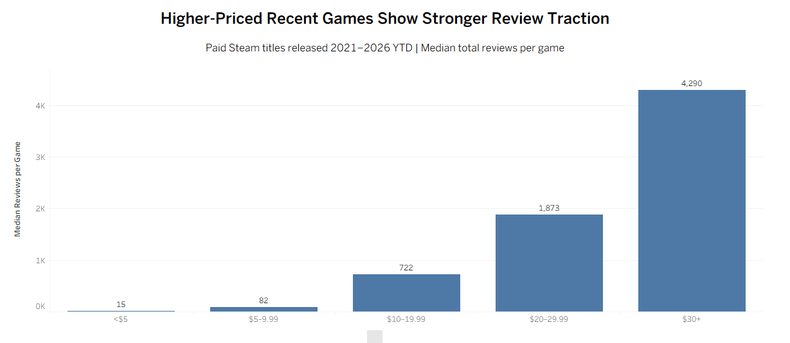
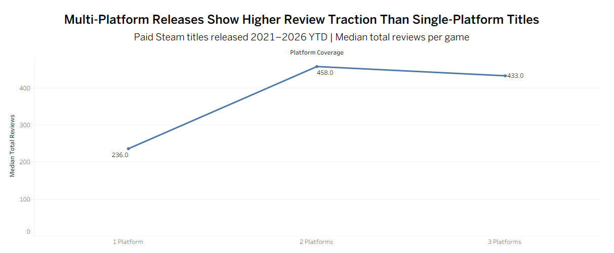
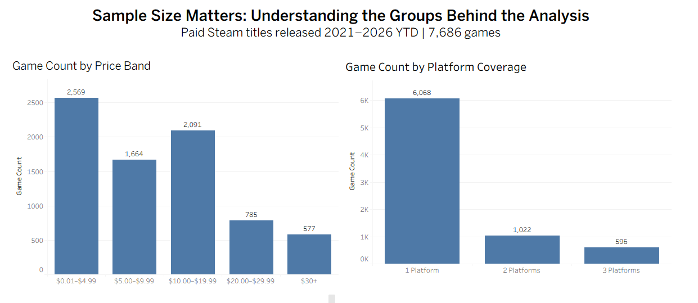
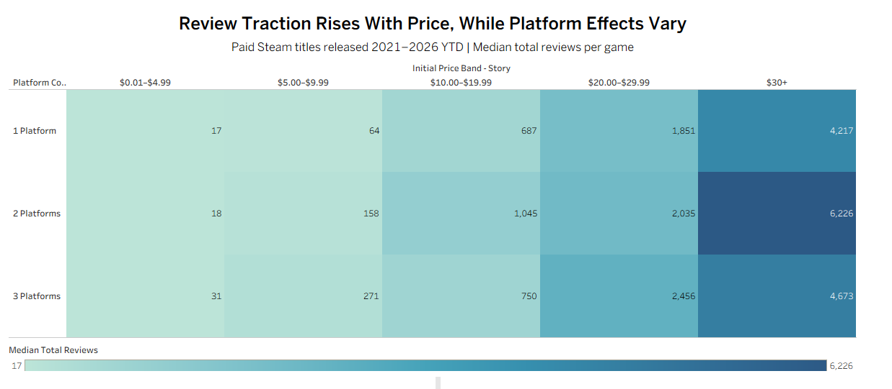
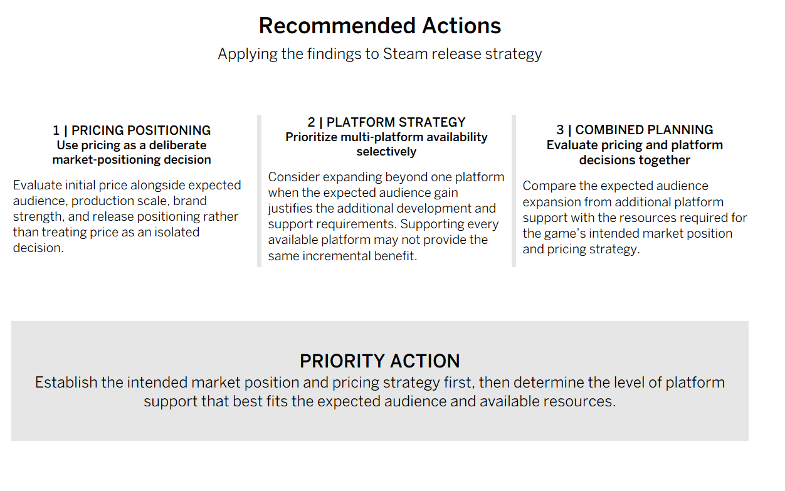

# Steam Review Traction Analysis

## Project Overview

This capstone project analyzes review traction among recent paid Steam releases, with a specific focus on initial pricing and platform availability.

Using Tableau, I examined 7,686 paid Steam titles released from 2021 through 2026 year-to-date to identify how pricing and platform strategy are associated with typical review traction and what developers and publishers can learn from those patterns when planning releases.

The analysis combines market segmentation, sample-size evaluation, comparative visualization, and stakeholder-focused recommendations in an interactive Tableau Story.

## Business Question

**Among paid Steam games released from 2021 through 2026 YTD, how are initial price and platform availability associated with review traction, and what can developers and publishers learn from those patterns when planning releases?**

## Analysis Scope

- **Population:** Paid Steam titles with a valid initial price
- **Time Period:** 2021–2026 YTD
- **Primary Factors:** Initial price and platform availability
- **Traction Metric:** Median total reviews per game
- **Sample Size:** 7,686 games
- **Platform Groups:** One, two, or three recorded platforms

## Methodology

Median total reviews per game was used to represent typical review traction because a small number of extremely high-review titles can heavily influence the review-count distribution.

Game count was analyzed separately to provide sample-size context. This distinction allows the project to evaluate both typical traction within each group and the number of titles supporting each comparison.

Price was grouped into five mutually exclusive bands:

- $0.01–$4.99
- $5.00–$9.99
- $10.00–$19.99
- $20.00–$29.99
- $30+

The analysis first examines pricing and platform availability independently, then combines both factors to evaluate how their relationships change across market segments.

## Tools Used

- Tableau
- Exploratory data analysis
- Data filtering and segmentation
- Calculated fields
- Median-based comparison
- Sample-size analysis
- Data visualization
- Dashboard and Story development
- Stakeholder-focused data storytelling

## Project Highlights

### Higher-Priced Recent Games Show Stronger Typical Review Traction

Median review traction increased substantially across higher initial-price bands:

| Initial Price Band | Median Total Reviews |
| --- | ---: |
| $0.01–$4.99 | 15 |
| $5.00–$9.99 | 82 |
| $10.00–$19.99 | 722 |
| $20.00–$29.99 | 1,873 |
| $30+ | 4,290 |

Pricing showed the clearest and most consistent relationship with review traction in the analysis. This relationship is associative rather than causal, as higher-priced games may also differ in development budget, marketing support, publisher strength, brand recognition, or other characteristics.

### Multi-Platform Releases Show Stronger Typical Traction

Single-platform titles had a median of **236 reviews**, compared with **458** for two-platform releases and **433** for three-platform releases.

The largest difference therefore occurred between single-platform and multi-platform titles. Moving from two platforms to three did not produce another clear increase in typical traction.

### Sample Size Provides Important Context

The final analysis includes **7,686 games**, but those games are not distributed evenly across the comparison groups.

By platform coverage:

- **6,068** games support one recorded platform
- **1,022** support two platforms
- **596** support three platforms

Higher-price groups also contain substantially fewer titles than lower-price groups.

Game count is used as sample-size context rather than as a measure of traction. These differences are particularly important when interpreting smaller price × platform combinations.

### Pricing Remains More Consistent When Both Factors Are Combined

The combined price × platform analysis shows that median review traction generally increases across higher price bands within all three platform strategies.

Platform effects are less consistent within individual price tiers. Neither two-platform nor three-platform releases lead across every price group.

This suggests that pricing and platform availability should be evaluated together rather than assuming that additional platform support provides the same benefit for every release strategy.

## Recommended Actions

### 1. Use Pricing as a Deliberate Market-Positioning Decision

Evaluate initial price alongside expected audience, production scale, brand strength, and overall release positioning rather than treating price as an isolated decision.

### 2. Prioritize Multi-Platform Availability Selectively

Consider expanding beyond one platform when the expected audience gain justifies the additional development and support requirements. Supporting every available platform may not provide the same incremental benefit.

### 3. Evaluate Pricing and Platform Decisions Together

Compare the expected audience expansion from additional platform support with the resources required for the title's intended market position and pricing strategy.

**Priority Action:** Establish the intended market position and pricing strategy first, then determine the level of platform support that best fits the expected audience and available resources.

## Key Findings

- Pricing showed the clearest and most consistent relationship with typical review traction.
- Median reviews increased across every higher initial-price band analyzed.
- Multi-platform titles showed stronger typical traction than single-platform titles.
- Two- and three-platform releases performed similarly overall.
- Platform effects varied more when examined within individual price tiers.
- Sample sizes were substantially uneven across price and platform groups, making context important when interpreting smaller segments.
- The observed relationships are associations and should not be interpreted as proof of causation.

## Limitations

The analysis identifies associations rather than causal effects. Marketing investment, development budget, publisher reputation, genre, franchise recognition, game quality, and other unobserved factors may also influence review traction.

Time in market is another limitation because older releases have had more time to accumulate reviews. The 2026 data is also year-to-date and will continue to change.

Finally, some price × platform combinations contain substantially fewer titles than others, so smaller groups should be interpreted cautiously.

## Next Steps

Future analysis could incorporate stronger business outcomes such as sales, revenue, wishlists, or player-count data; control for additional characteristics such as genre, publisher, and release scale; and revisit the analysis after the complete 2026 release year is available.

## Interactive Tableau Story

[View the complete Steam Review Traction Analysis on Tableau Public](https://public.tableau.com/app/profile/marissa.sweet/viz/SteamMarketTractionAnalysis/SteamReviewTractionAnalysisStory?publish=yes)

The interactive Tableau Story walks through the business problem, pricing and platform findings, sample-size context, combined strategy analysis, recommended actions, limitations, and next steps.

## Skills Demonstrated

- Tableau dashboard and Story development
- Exploratory data analysis
- Data segmentation
- Calculated fields
- Comparative analysis
- Sample-size evaluation
- Data visualization
- Business analysis
- Analytical interpretation
- Stakeholder communication
- Translating findings into actionable recommendations

## Project Files

- **Interactive Tableau Story:** [View on Tableau Public](https://public.tableau.com/app/profile/marissa.sweet/viz/SteamMarketTractionAnalysis/SteamReviewTractionAnalysisStory?publish=yes)
- **Project Visuals:** `images/` contains selected dashboards from the final capstone presentation.

## About This Project

This project was completed as the capstone for my Data Analytics Career Program and was developed as an end-to-end portfolio project demonstrating Tableau analysis, business problem framing, analytical reasoning, visualization, and stakeholder-focused communication.
